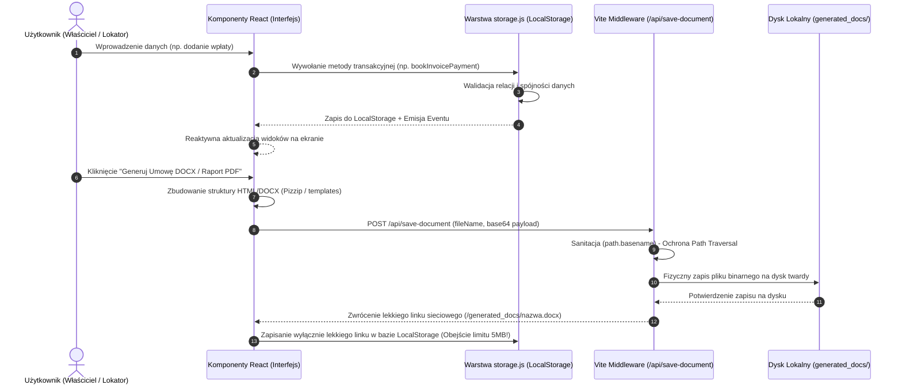
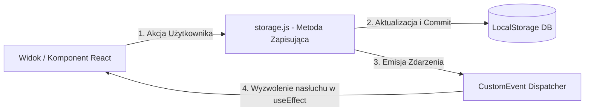

# RentPortal - Model Funkcjonalny Systemu (Reverse Engineering)

Niniejszy dokument stanowi kompletne, wsteczne odwzorowanie inżynieryjne (Reverse Engineering) systemu **RentPortal** w jego obecnym, stabilnym i zamrożonym stanie (`v1.0.0`). Opisuje architekturę komponentów, przepływy danych, silniki matematyczne oraz punkty potencjalnych przyszłych rozszerzeń.

---

## 🏗️ 1. Architektura Systemu

RentPortal jest nowoczesną, responsywną aplikacją typu PWA (Progressive Web App) zbudowaną w oparciu o architekturę **SPA (Single Page Application)** z wykorzystaniem technologii **Vite + React** oraz **Tailwind CSS**. Aplikacja symuluje relacje najemca-właściciel w bezpiecznym, w pełni reaktywnym środowisku lokalnym.

### 📐 Struktura Modułowa i Komponentowa

```mermaid
graph TD
    %% Base Engine
    subgraph "WARSTWA URUCHOMIENIOWA i KONTROLNA"
        App[App.jsx - Router / Simulator Belka]
        SW[sw.js - PWA / Offline Service Worker]
        Storage[storage.js - Transakcyjna baza LocalStorage]
        MockData[mockData.js - Bootstrapper danych]
        ViteConfig[vite.config.js - Node.js File System API]
    end

    %% Landlord Portal
    subgraph "PANEL ZARZĄDCY / WŁAŚCICIELA (Landlord)"
        LDash[Dashboard.jsx - Oś Czasu / Quick Actions]
        LProp[Properties.jsx - CRM Lokali / Umowy DOCX / Protokoły Handovers]
        LInv[Invoices.jsx - ROI-ROE / Rejestr Płatności / Raporty PDF]
        LMeters[Meters.jsx - Grupy Liczników / Stawki VAT]
        LMsgs[Messages.jsx - Komunikator / Kreator Monitów WZP]
        LArch[Archive.jsx - Archiwum Lokatorów / Logi Chatów / Timeline]
        LTen[Tenants.jsx - Baza Lokatorów CRM]
    end

    %% Tenant Portal
    subgraph "PANEL LOKATORA (Tenant)"
        TDash[Dashboard.jsx - Stan Najmu / Info o Właścicielu]
        TInv[Invoices.jsx - Wykaz Opłat / Salda / Tabela Czynszów]
        TMeters[Meters.jsx - Zgłaszanie Stanów / Wyliczenia Kosztów]
        TMsgs[Messages.jsx - Chat z Właścicielem / Pobieranie PDF-DOCX]
    end

    %% Relationships
    App --> LDash
    App --> TDash
    
    %% Storage links
    LDash -.-> Storage
    LProp -.-> Storage
    LInv -.-> Storage
    LMeters -.-> Storage
    LMsgs -.-> Storage
    LArch -.-> Storage
    LTen -.-> Storage
    
    TDash -.-> Storage
    TInv -.-> Storage
    TMeters -.-> Storage
    TMsgs -.-> Storage

    %% File API integration
    LProp ==>|POST /api/save-document| ViteConfig
    LInv ==>|POST /api/save-document| ViteConfig
    LMsgs ==>|GET /generated_docs/| ViteConfig
    TMsgs ==>|GET /generated_docs/| ViteConfig
```



### 🧬 Reaktywność Oparta na Zdarzeniach (Event-Driven State Sync)
W celu zagwarantowania, że zmiana danych w jednej zakładce (np. zatwierdzenie odczytu licznika) natychmiast odświeża interfejs w innej (np. pre-fill opłaty za media w kreatorze faktur), RentPortal wykorzystuje globalną szynę zdarzeń przeglądarki (`Window CustomEvents`).

Kluczowe zdarzenia wyzwalające asynchroniczne odświeżenie danych:
* `"rentportal_users_updated"` – Reaktywne przeładowanie profili, notatek CRM, osi czasu najmu oraz aktualizacji danych kontaktowych zarządcy u lokatora.
* `"rentportal_invoices_updated"` – Natychmiastowe odświeżenie salda finansowego, wykresu Cash Flow, wskaźników ROI/ROE oraz wykazu anomalii płatności.
* `"rentportal_meters_updated"` – Automatyczne przeliczenie agregatów zużycia, aktualizacja statusu zatwierdzenia liczników i kosztorysów.
* `"rentportal_messages_updated"` – Sygnalizacja nadejścia nowej wiadomości lub oficjalnego monitu windykacyjnego na czacie (w czasie rzeczywistym).
* `"rentportal_properties_updated"` – Reaktywna synchronizacja stanów lokali, załączonych umów oraz protokołów zdawczo-odbiorczych.

---

## 🔄 2. Przepływ Danych (Data Flow)

System realizuje hybrydowy przepływ danych: ustrukturyzowane informacje relacyjne są zapisywane transakcyjnie w przeglądarkowej pamięci lokalnej, natomiast ciężkie pliki binarne (umowy DOCX, protokoły HTML/PDF) są strumieniowane fizycznie na dysk twardy komputera.



### 🚫 Brak Pętli Danych (Unidirectional Data Flow Enforcement)
W architekturze RentPortal **wykluczono powstawanie pętli danych (infinite loop render / cyclical dependency)** poprzez ścisłe przestrzeganie jednokierunkowego przepływu danych (Flux/React Paradigm):



1. **Brak sprzężeń zwrotnych bezpośrednio z renderera:** Wartości obliczeniowe (np. taryfy mediów, ROI/ROE) są funkcjami czystymi (pure functions). Żaden widok nie modyfikuje bazy danych bezpośrednio w trakcie cyklu renderowania (brak wywołań mutujących stan wewnątrz JSX lub głównego ciała funkcji komponentu).
2. **Asynchroniczne wyzwalanie zdarzeń:** Zapisy w `storage.js` są wykonywane synchronicznie jako transakcja (np. `saveItems`), po czym następuje rozesłanie zdarzenia `window.dispatchEvent` w tle. React przechwytuje te zdarzenia wyłącznie za pomocą hooka `useEffect`, który wyzwala kontrolowane przeładowanie danych do stanu lokalnego komponentu (`setItems`), odcinając możliwość powstania nieskończonej pętli aktualizacji stanów.

---

## 💾 3. Stan Lokalny (Local State) vs Stan Globalny (Global State)

System ściśle rozdziela stany, które muszą być utrwalone w bazie danych, od stanów tymczasowych, sterujących wyłącznie warstwą prezentacji.

| Kategoria Stanu | Lokalizacja / Przechowywanie | Zakres (Scope) | Przykład i Rola |
| :--- | :--- | :--- | :--- |
| **Stan Globalny (Utrwalany)** | Baza LocalStorage (`storage.js` / `USERS`, `PROPERTIES`, `INVOICES`, `METERS`, `MESSAGES`) | Cała aplikacja. Wspólny dla widoków Właściciela i Lokatora. Synchronizowany reaktywnie. | Dane umów, przypisanie lokatorów, zarejestrowane faktury, wpłaty, zatwierdzone liczniki, wiadomości i monity czatu. |
| **Stan Lokalny Komponentu (Tymczasowy)** | Hook `useState` w konkretnych plikach `.jsx` | Izolowany do danego komponentu/modułu UI. Ulega wyczyszczeniu przy przejściu na inną zakładkę lub odświeżeniu strony. | Dane wpisywane do formularza edycji licznika, wybrany wątek na czacie, tymczasowe filtry wyszukiwania na liście anomalii, stan otwarcia modalu (isOpen), wartości suwaków ROI, wpisywane notatki w polu tekstowym przed zapisem. |
| **Stan Sesji Symulatora** | LocalStorage (`rentportal_session_v3`) | Globalny dla symulatora ról. | Określa, czy aktualnie symulujemy rolę Właściciela (Krzysztof), czy wybranego Lokatora, sterując w ten sposób routingiem i filtrowaniem uprawnień widoków. |

---

## 🧮 4. Główne Silniki Matematyczne i Przetwarzanie Danych

Aplikacja posiada zaawansowane silniki kalkulacyjne działające bezpośrednio po stronie klienta:

### 1. Silnik ROI / ROE (Rentowność Inwestycji)
Ocenia finansową efektywność danej nieruchomości lub całego portfela:
$$\text{NOI (Realny Zysk Operacyjny Netto)} = \text{Suma czynszów najmu} - \text{Koszty administracyjne spółdzielni} - \text{Ubezpieczenia} - \text{Remonty i naprawy} - \text{Podatek zryczałtowany (8.5\%)}$$
$$\text{ROI (Return on Investment)} = \frac{\text{NOI} \times 12}{\text{Wartość rynkowa nieruchomości}} \times 100\%$$
$$\text{ROE (Return on Equity)} = \frac{(\text{NOI} - \text{Rata kredytu}) \times 12}{\text{Wkład własny (Equity)}} \times 100\%$$

### 2. Kosztowy Silnik Taryfowy Mediów (Meters Engine)
Oblicza koszt zużycia mediów na podstawie odczytów liczników i składowych taryfowych:
$$\text{Zużycie (Q)} = \text{Odczyt bieżący} - \text{Odczyt poprzedni (Baseline)}$$
$$\text{Okres czasu (M)} = \frac{\text{Różnica dni między odczytami}}{30.4} \text{ (ułamek miesiąca)}$$
$$\text{Koszt Brutto (Prąd/Gaz)} = \left[ (Q \times \text{Stawka zmienna}) + (M \times \text{Opłata stała abonentowa}) \right] \times 1.23 \text{ (23% VAT)}$$

### 3. Silnik Kar Kaucji za Przedterminowe Rozwiązanie Umowy
Wylicza kwotę potrącenia z kaucji w przypadku opuszczenia lokalu przed terminem:
$$\text{Kara} = \begin{cases} 
3 \times \text{Czynsz} & \text{gdy czas trwania najmu} < 6 \text{ mies.} \\ 
1.5 \times \text{Czynsz} & \text{gdy najem trwa od } 6 \text{ do } 9 \text{ mies.} \\ 
1 \times \text{Czynsz} & \text{gdy najem trwa od } 9 \text{ do } 11 \text{ mies.} \\
0 \text{ PLN} & \text{gdy najem trwa powyżej } 11 \text{ mies.} 
\end{cases}$$

### 4. Silnik Klasyfikacji Ryzyka Płatności (Aging Debts Widget)
Analizuje opóźnienia faktur względem daty referencyjnej (`2026-06-01`):
* **Niskie ryzyko** (Low): Opóźnienie płatności $1 - 3$ dni.
* **Średnie ryzyko** (Medium): Opóźnienie płatności $4 - 9$ dni.
* **Wysokie ryzyko** (High): Opóźnienie płatności $10 - 29$ dni.
* **Krytyczne ryzyko** (Critical): Opóźnienie płatności $\ge 30$ dni.

---

## 🛡️ 5. Obsługa Przypadków Brzegowych w Kalkulatorach (Validation & Edge Cases)

W celu ochrony przed awariami aplikacji wywołanymi wprowadzeniem niepoprawnych typów danych lub pustych pól, RentPortal stosuje **restrykcyjny system walidacji brzegowej**:

### 🚫 Walidacja Pustych Wartości i Złych Typów (Non-Numeric Protection)
* **Zabezpieczenie parsowania:** Przy przetwarzaniu pól kwot (np. czynsz najmu, stawki taryfowe mediów, wkład własny) wartości są poddawane natychmiastowej konwersji i zabezpieczeniu przed wartościami pustymi/nieliczbowymi:
  ```javascript
  const parseAmount = (val) => {
    const parsed = parseFloat(val);
    return isNaN(parsed) || parsed < 0 ? 0 : parsed;
  };
  ```
* **Wpływ na Silnik ROI:** Zapobiega to powstawaniu wartości `NaN` na ekranie finansowym, zastępując je bezpieczną wartością `0.00 PLN` w przypadku braku wpisu.

### 🧮 Zabezpieczenie przed Dzieleniem przez Zero (Division by Zero)
* **Problem:** W silnikach ROI/ROE brak wpisanej wartości nieruchomości lub wkładu własnego (wartości równe 0) wywołałby błędy matematyczne typu `Infinity` lub `NaN`.
* **Rozwiązanie w kodzie:** Silniki kalkulacyjne zawierają twarde warunki logiczne blokujące dzielenie:
  ```javascript
  const calculatedROI = propertyValue > 0 ? (annualNOI / propertyValue) * 100 : 0;
  const calculatedROE = equityValue > 0 ? (annualNetProfit / equityValue) * 100 : 0;
  ```
  Jeśli parametry te wynoszą 0, system bezpiecznie wyświetla rentowność na poziomie `0.00%`.

### 📅 Logika Chronologii Dat (Chronological Clamping)
* **Chronologia najmu:** Przy przypisywaniu najemcy lub generowaniu umów, system blokuje możliwość ustawienia daty zakończenia umowy przed datą jej rozpoczęcia. Formularze posiadają wbudowane walidatory `min` na polach typu `date`, a silnik osi czasu clampuje wartości ujemne do zera.
* **Puste daty odczytów:** Brak podanej daty odczytu licznika skutkuje automatycznym przypisaniem bieżącej daty systemowej (`new Date().toISOString().split('T')[0]`), co zapobiega crashom kalkulatora czasu trwania taryf.

---

## 📝 6. Stan Obecny (Działające Funkcjonalności)

Aplikacja RentPortal posiada w pełni ukończony, przetestowany i zintegrowany zestaw funkcji biznesowych:

### 🏠 Zarządzanie Nieruchomościami i CRM Lokatorów
- [x] **Kafelki lokali (Properties)**: Pełne CRUD (dodawanie, edycja, usuwanie lokali). Obsługa powierzchni ($m^2$) i numeru Księgi Wieczystej (KW).
- [x] **System Soft-Delete**: Archiwizacja lokatorów (przeniesienie do karty **Archiwum**) chroniąca historię wpłat i liczników.
- [x] **Deduplikacja Samolecząca**: Automatyczna detekcja i scalanie zdublowanych kont lokatorów o tym samym e-mailu.
- [x] **Oś czasu najmu (Timeline)**: Estetyczna wizualizacja historii relacji (Rejestracja, Rozpoczęcie, Rozwiązanie, Reaktywacja).
- [x] **Wyszukiwalne notatki**: Zintegrowany rejestr rozmów i ustaleń w profilach lokatorów.

### 💰 Finanse, Analiza ROI/ROE i Raporty
- [x] **Rejestr Płatności**: Podział faktury na składowe (*Czynsz podstawowy*, *Czynsz administracyjny*, *Opłata za media*).
- [x] **Autofill Mediów**: Automatyczne pobieranie zatwierdzonych kosztów liczników z danego miesiąca i uzupełnianie w fakturze.
- [x] **Księgowanie i Wpłaty**: Tryb zapłaty częściowej i nadpłat z real-time kalkulatorem salda. Możliwość omyłkowego usunięcia wpisu.
- [x] **Biznesowy Pulpit Właściciela**: Wykresy Cash Flow, ekspozycja na ryzyko zadłużenia (Aging Debts) oraz wskaźniki ROI/ROE.
- [x] **Generator Raportów Płatności**: Kreator zestawienia faktur z tabelą podsumowań księgowych na dole, bezpośrednim pobieraniem na dysk oraz wysyłką do lokatora czatem.

### 🔌 Zarządzanie Licznikami (Meters Engine)
- [x] **Logowanie stanów**: Możliwość zgłaszania stanu licznika przez lokatora oraz ręczny wpis zarządcy z autouzupełnianiem numeru seryjnego.
- [x] **Dwuetapowa weryfikacja**: Odczyty lokatorów oznaczone jako `Oczekuje` (podświetlone na żółto z podglądem kosztu).
- [x] **Zatwierdzanie szybką akcją**: Jedno kliknięcie (ptaszek ✔️) zmienia status na `Zatwierdzony` i podświetla wiersz na zielono.

### 📄 Generator Dokumentacji Prawnej i Protokolarnej
- [x] **Generator Umów DOCX**: Auto-kompilacja szablonu Word na podstawie profilu lokatora i lokalu z gramatycznym translatorem liczb na słowa polskie (`dwa tysiące pięćset PLN`).
- [x] **Dwuetapowy Protokół Zdawczo-Odbiorczy**: Kreator protokołu wejściowego i wyjściowego z cyfrowym podpisem (Caveat font) i oceną stanu elementów (1-5 gwiazdek).
- [x] **Raport Różnicowy (Difference Report)**: Automatyczne zestawienie zniszczeń i ubytków między protokołem początkowym a końcowym, wyliczenie kosztów napraw oraz potrąceń z kaucji w formie gotowego arkusza HTML/PDF.

### 💬 Komunikator i Automatyczna Windykacja (Dunning Engine)
- [x] **Automatyczna detekcja zaległości**:
  - **T+3 dni**: Auto-wysłanie miękkiego upomnienia (Soft Reminder) na czacie.
  - **T+10 dni**: Wygenerowanie oficjalnego, ostatecznego przedsądowego Wezwania do Zapłaty.
- [x] **Monity Windykacyjne**: Banner zatwierdzenia monitu dla właściciela, podgląd HTML pisma, automatyczne dołączenie pliku jako załącznika czatu, pobieranie bezpośrednie na dysk i logowanie wpisu w Rejestrze Notatek Lokatora.

---

## 🔮 7. Punkty Rozszerzeń (Extension Points)

Kod aplikacji został zaprojektowany z myślą o modułowości i czytelności, co pozwala na łatwe wdrażanie nowych funkcjonalności w wyznaczonych punktach:

### 1. Przesunięcie warstwy persystencji na serwer (Backend API)
* **Punkt w kodzie:** [storage.js](file:///Users/KRZYSZTOF/Documents/ANTIGRAVITY/NIERUCHOMOSCI_PROJECT/NIERUCHOMOSCI_ZARZAD/src/utils/storage.js)
* **Jak rozszerzyć:** Obecnie wszystkie funkcje (np. `getInvoices`, `addProperty`, `bookInvoicePayment`) czytają/zapisują dane do `localStorage` za pomocą metod pomocniczych `getItems` / `saveItems`. Warstwę tę można bezpośrednio przepiąć na asynchroniczne zapytania sieciowe (`fetch` / `axios`) do zewnętrznego API backendowego (np. Django, Node.js, Spring Boot), bez konieczności modyfikowania kodu komponentów React, gdyż te polegają wyłącznie na interfejsach eksportowanych przez `storage.js`.

### 2. Integracja bramek płatności (Stripe / PayU / BLIK)
* **Punkt w kodzie:** `Invoices.jsx` (Lokator) / Moduł płatności lokatora
* **Jak rozszerzyć:** Pod tabelą opłat czynszowych u lokatora przygotowano przyciski statusu płatności. Można tu wpiąć SDK płatności online. Po udanej autoryzacji transakcji system wywoła zdarzenie sieciowe (Webhook), które po stronie serwera automatycznie odpali funkcję `bookInvoicePayment` w bazie danych, ułatwiając bezobsługową autoryzację rozliczeń.

### 3. Kompilator PDF po stronie serwera (np. Puppeteer / pdfkit)
* **Punkt w kodzie:** `vite.config.js` (Middleware `/api/save-document`)
* **Jak rozszerzyć:** Obecnie aplikacja generuje pliki jako A4 print-ready HTML i zapisuje je bezpośrednio na dysku, pozwalając na pobieranie ich jako dokumentów HTML. W middleware serwera, tuż przed zapisem bufora na dysk, można zaimplementować wywołanie biblioteki Puppeteer (np. `page.pdf()`), aby automatycznie kompilować te dokumenty do natywnych, profesjonalnych plików `.pdf` przed ich odesłaniem i zapisaniem.

### 4. System IoT dla liczników (Automatyczne Odczyty Telemetryczne)
* **Punkt w kodzie:** [storage.js](file:///Users/KRZYSZTOF/Documents/ANTIGRAVITY/NIERUCHOMOSCI_PROJECT/NIERUCHOMOSCI_ZARZAD/src/utils/storage.js) (funkcja `addMeterReading`)
* **Jak rozszerzyć:** Zamiast ręcznego formularza lokatora, można wystawić endpoint API dla inteligentnych liczników IoT (np. ESP32 z nakładką optyczną). Urządzenie wysyła stan licznika raz na miesiąc, co automatycznie wyzwala funkcję `addMeterReading` ze statusem `approved`. System natychmiast kalkuluje koszty i dołącza je do najbliższej faktury bez zaangażowania człowieka.
