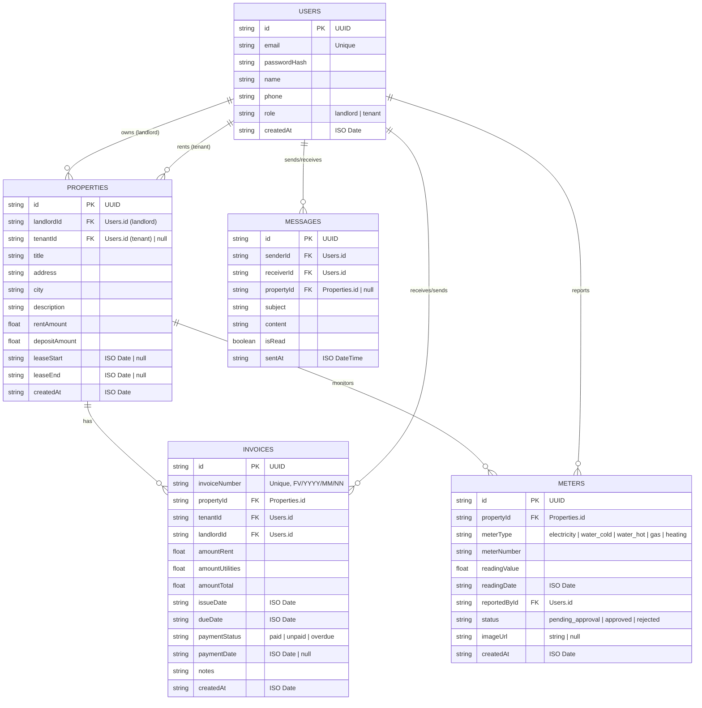

# RentPortal - Specyfikacja Bazy Danych (MVP LocalStorage)

Niniejszy dokument przedstawia formalną architekturę i schemat logiczny bazy danych dla aplikacji **RentPortal** obsługującej najem nieruchomości. Ze względu na charakterystykę wersji MVP, bazujemy na strukturze zorganizowanej w modelu relacyjnym, która jest mapowana i serializowana do formatu JSON w przeglądarkowym magazynie **LocalStorage**.

---

## 1. Architektura Relacyjna (Diagram ERD)

Poniższy diagram w notacji Crow's Foot przedstawia powiązania i relacje między kluczowymi encjami w systemie.

---

## 2. Szczegółowy Słownik Danych

### 2.1. Kolekcja `users`
Przechowuje konta użytkowników systemu z podziałem na role: Właściciel (`landlord`) i Lokator (`tenant`).

| Pole | Typ | Modyfikator | Opis |
| :--- | :--- | :--- | :--- |
| `id` | `string` | **PK**, UUIDv4 | Unikalny identyfikator użytkownika. |
| `email` | `string` | Unikalny, Not Null | Adres e-mail używany do logowania. |
| `passwordHash` | `string` | Not Null | Hasło w postaci zahaszowanej/tekstowej (w MVP proste hasło). |
| `name` | `string` | Not Null | Imię i nazwisko użytkownika. |
| `phone` | `string` | Not Null | Numer kontaktowy telefonu. |
| `role` | `string` | Enum, Not Null | Dozwolone wartości: `'landlord'`, `'tenant'`. |
| `createdAt` | `string` | ISO Date, Not Null | Data i czas rejestracji profilu. |

---

### 2.2. Kolekcja `properties`
Przechowuje informacje o lokalach mieszkalnych/komercyjnych oraz ich statusie najmu.

| Pole | Typ | Modyfikator | Opis |
| :--- | :--- | :--- | :--- |
| `id` | `string` | **PK**, UUIDv4 | Unikalny identyfikator nieruchomości. |
| `landlordId` | `string` | **FK** (`users.id`) | Właściciel przypisany do lokalu. |
| `tenantId` | `string` | **FK** (`users.id`), Nullable | Aktualny lokator (null, jeśli lokal jest wolny). |
| `title` | `string` | Not Null | Nazwa marketingowa/krótki opis (np. "Apartament Jasny, Rynek"). |
| `address` | `string` | Not Null | Dokładny adres nieruchomości. |
| `city` | `string` | Not Null | Miasto. |
| `description` | `string` | Nullable | Dodatkowy opis nieruchomości, udogodnień itp. |
| `rentAmount` | `number` | Not Null, Float | Miesięczny czynsz podstawowy w PLN. |
| `depositAmount` | `number` | Not Null, Float | Wysokość kaucji zwrotnej w PLN. |
| `leaseStart` | `string` | ISO Date, Nullable | Data rozpoczęcia umowy najmu (null, jeśli brak). |
| `leaseEnd` | `string` | ISO Date, Nullable | Data zakończenia umowy najmu (null, jeśli brak). |
| `createdAt` | `string` | ISO Date, Not Null | Data dodania lokalu do systemu. |

---

### 2.3. Kolekcja `invoices`
Przechowuje dane o płatnościach, czynszach i rozliczeniach mediów wygenerowanych przez właściciela dla lokatora.

| Pole | Typ | Modyfikator | Opis |
| :--- | :--- | :--- | :--- |
| `id` | `string` | **PK**, UUIDv4 | Unikalny identyfikator faktury/rachunku. |
| `invoiceNumber` | `string` | Unikalny, Not Null | Sformatowany numer dokumentu, np. `FV/2026/05/0001`. |
| `propertyId` | `string` | **FK** (`properties.id`) | Nieruchomość, której dotyczy opłata. |
| `tenantId` | `string` | **FK** (`users.id`) | Lokator (płatnik). |
| `landlordId` | `string` | **FK** (`users.id`) | Właściciel (odbiorca płatności). |
| `amountRent` | `number` | Not Null, Float | Kwota czynszu podstawowego w PLN. |
| `amountUtilities` | `number` | Not Null, Float | Kwota za media (woda, prąd, gaz itp.) w PLN. |
| `amountTotal` | `number` | Not Null, Float | Suma opłat (`amountRent` + `amountUtilities`). |
| `issueDate` | `string` | ISO Date, Not Null | Data wystawienia rachunku. |
| `dueDate` | `string` | ISO Date, Not Null | Termin płatności. |
| `paymentStatus` | `string` | Enum, Not Null | `'paid'` (opłacona), `'unpaid'` (nieopłacona), `'overdue'` (zaległa). |
| `paymentDate` | `string` | ISO Date, Nullable | Rzeczywista data zaksięgowania wpłaty. |
| `notes` | `string` | Nullable | Komentarze, numer konta bankowego itp. |
| `createdAt` | `string` | ISO Date, Not Null | Data utworzenia rekordu. |

---

### 2.4. Kolekcja `meters`
Rejestruje odczyty liczników (np. energii elektrycznej, wody, gazu) wprowadzane przez lokatora bądź właściciela.

| Pole | Typ | Modyfikator | Opis |
| :--- | :--- | :--- | :--- |
| `id` | `string` | **PK**, UUIDv4 | Unikalny identyfikator odczytu. |
| `propertyId` | `string` | **FK** (`properties.id`) | Nieruchomość, w której znajduje się licznik. |
| `meterType` | `string` | Enum, Not Null | Typ medium: `'electricity'`, `'water_cold'`, `'water_hot'`, `'gas'`, `'heating'`. |
| `meterNumber` | `string` | Not Null | Numer seryjny fizycznego licznika. |
| `readingValue` | `number` | Not Null, Float | Wartość odczytu (w odpowiedniej jednostce np. kWh, m³). |
| `readingDate` | `string` | ISO Date, Not Null | Data dokonania odczytu licznika. |
| `reportedById` | `string` | **FK** (`users.id`) | Użytkownik zgłaszający odczyt. |
| `status` | `string` | Enum, Not Null | `'pending_approval'`, `'approved'`, `'rejected'`. Odczyt lokatora wymaga zatwierdzenia przez właściciela. |
| `imageUrl` | `string` | Nullable | Opcjonalny URL/Base64 ze zdjęciem stanu licznika. |
| `createdAt` | `string` | ISO Date, Not Null | Data utworzenia wpisu w systemie. |

---

### 2.5. Kolekcja `messages`
Przechowuje konwersacje i wiadomości przesyłane bezpośrednio w aplikacji pomiędzy Właścicielem a Lokatorami.

| Pole | Typ | Modyfikator | Opis |
| :--- | :--- | :--- | :--- |
| `id` | `string` | **PK**, UUIDv4 | Unikalny identyfikator wiadomości. |
| `senderId` | `string` | **FK** (`users.id`) | Nadawca wiadomości. |
| `receiverId` | `string` | **FK** (`users.id`) | Odbiorca wiadomości. |
| `propertyId` | `string` | **FK** (`properties.id`), Nullable | Kontekst nieruchomości, do której odnosi się sprawa. |
| `subject` | `string` | Not Null | Temat wiadomości. |
| `content` | `string` | Not Null | Treść wiadomości. |
| `isRead` | `boolean` | Not Null | Czy wiadomość została odczytana przez adresata. |
| `sentAt` | `string` | ISO DateTime, Not Null | Data i godzina wysłania. |

---

## 3. Reprezentacja w LocalStorage

Aplikacja RentPortal będzie przechowywać powyższe tabele w przestrzeni `window.localStorage` jako osobne stringi JSON pod zdefiniowanymi kluczami:

- `rentportal_users` - tablica obiektów User
- `rentportal_properties` - tablica obiektów Property
- `rentportal_invoices` - tablica obiektów Invoice
- `rentportal_meters` - tablica obiektów Meter
- `rentportal_messages` - tablica obiektów Message
- `rentportal_session` - aktualnie zalogowany użytkownik (do symulacji sesji)

Dostęp do danych będzie realizowany przez warstwę abstrakcji w `/src/utils/storage.js` gwarantującą transakcyjność i spójność referencyjną (np. uniemożliwienie przypisania nieistniejącego lokatora do nieruchomości).
